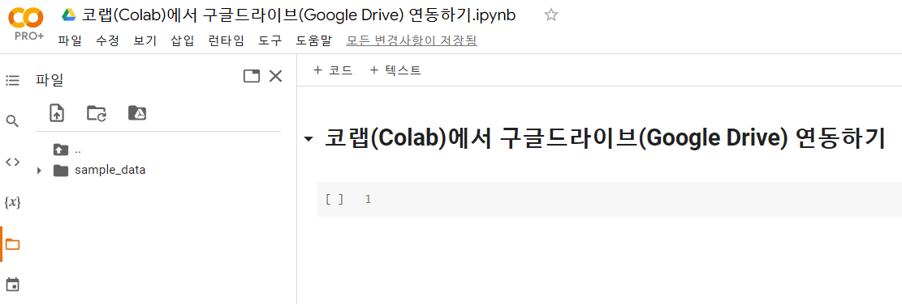
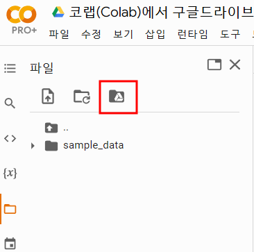

구글 코랩(Colab)에서 구글 드라이브는 두가지 방법으로 연결할 수 있다.


첫번째, 마우스로 구글드라이브 연결버튼 클릭해서 방법

두번째, 코랩에서 구글드라이브 마운트에 연결하는 코드를 작성하여 실행하는 방법


둘다 같은 방법이기 때문에 사용환경에 맞게 사용하면 됩니다. 

`Colab`과 `구글드라이브`를 연결


폴더 버튼을 클릭하면 현재 탐색창에 







```python
from google.colab import drive
drive.mount('/content/drive')
```

또는

```python
from google.colab import drive
drive.mount('/content/gdrive')
```


